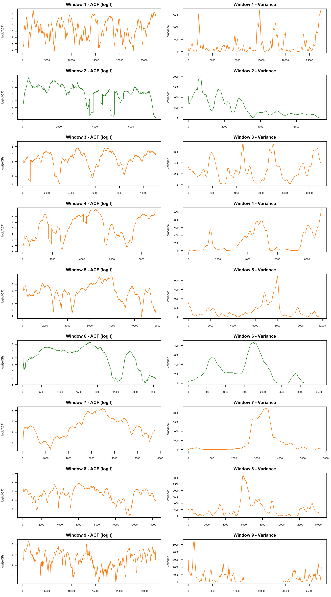

```{r setup, include=FALSE}
knitr::opts_chunk$set(echo = FALSE, cache=TRUE)
library(readr)
library(dplyr)
library(ggplot2)
library(spaero)
```

# Background

This is an analysis for Thoughtful Insights assessing the potential use of leading indicators based on the theory of critical slowing down for anticipating growth in a cryptocurrency market.
Several ecosystems are known to extreme changes in state due to nonlinear feedback.
Such changes of state are preceded by a phenomenon known as "critical slowing down" when these state changes are due to a bifurcation in the dynamical system.
Recent research has shown that critical slowing down nearly univerally is accompanied by observable changes in the summary statistics of a time series -- namely the variance and the autocorrelation -- which may therefore serve as generic statistical indicators of an approaching change of state.
For instance, it has been shown that statistical indicators anticipate the shift in shallow lakes from a desirable clear state to an undesirable turbid state via trophic cascade.
Here we investigate whether these statistical indicators might anticipate certain large swings in market behavior.
In particular, economic ``bubbles'' exhibit the kind of positive feedbacks that are associated with critical slowing down.

# Analysis

As an example, we performed a case study examining the value of cryptocurrencies from March 2021 to March 22.
The data were provided by Marcus Cunha.
First we load and clean the data, dropping one extreme outlier.

```{r data}
# Read and clean data
crypto <- read_csv("../cryptos_subsample.csv")

# Remove extreme outlier
max_val <- max(crypto$A_oneCoinUSDvalue, na.rm = TRUE)
crypto <- crypto[crypto$A_oneCoinUSDvalue != max_val, ]

# Order data
crypto <- crypto %>% arrange(A_time)
```

Next, we compute a statistical summary for each of 18 currencies with sample size, mean value, standard deviation, and coefficient of variation.

```{r summary}
summary_table <- crypto %>%
  group_by(tokenSymbol) %>%
  summarise(
    n = n(),
    mean = mean(A_oneCoinUSDvalue, na.rm = TRUE),
    sd = sd(A_oneCoinUSDvalue, na.rm = TRUE),
    cv = sd / mean,
    .groups = "drop"
  )
knitr::kable(summary_table, digits = 3)
```

Several currencies showed no variation in value.
These are dropped from further analysis.

```{r drops}
# Identify tokens with no variation
tokens_to_drop <- summary_table %>% 
  filter(sd == 0) %>% 
  pull(tokenSymbol)

# Remove them from the dataset
crypto <- crypto %>% 
  filter(!tokenSymbol %in% tokens_to_drop)
```

To familiarize ourselfes with the data we examines histograms of the raw values.
Notably, a few currencies exhibit multimodel distributions: GYRO, PinkS, TWX, and XEUS.
Bimodality is one indicator of possible alternative stable states, but can also arise for many other reasons.

```{r histograms}
ggplot(crypto, aes(x = A_oneCoinUSDvalue)) +
  geom_histogram(bins = 30, fill = "steelblue", color = "white") +
  scale_x_log10() +  # Helps if distribution is skewed
  facet_wrap(~ tokenSymbol, scales = "free") +
  labs(
    title = "Distribution of Cryptocurrency Values by Token",
    x = "One Coin USD Value (log scale)",
    y = "Count"
  ) +
  theme_minimal()
```

```{r sample}
# Sample a subset (optional, for development)
set.seed(123)  # For reproducibility
sample <- crypto %>% 
  slice_sample(n = 5000) %>%
  arrange(A_time)
```

Next we plot all the data by token over time.
It is clear that the values are highly dynamic, with most currencies showing some long term trend with large fluctuations.
Contrary to our expectation, rapid changes of value are not typically observed.

```{r plot}
# Plot using ggplot2
ggplot(sample, aes(x = A_time, y = A_oneCoinUSDvalue)) +
  geom_line() +
  scale_y_log10() +  # Optional: use log scale for better visual spread
  facet_wrap(~ tokenSymbol, scales = "free_y") +
  labs(
    title = "Time Series of Cryptocurrency Values",
    x = "Time",
    y = "One Coin USD Value (log scale)"
  ) +
  theme_minimal()
```

To exclude low frequency fluctuations in value, we first detrend the data using `loess` and then plot the residuals.
These residuals will be the main focus of subsequent analysis.

```{r detrend}
crypto_resids <- crypto %>%
  group_by(tokenSymbol) %>%
  arrange(A_time) %>%
  mutate(
    smoothed = loess(A_oneCoinUSDvalue ~ as.numeric(A_time), span = 0.2)$fitted,
    residual = A_oneCoinUSDvalue - smoothed
  ) %>%
  ungroup()

ggplot(crypto_resids, aes(x = A_time, y = residual)) +
  geom_line() +
  facet_wrap(~ tokenSymbol, scales = "free_y") +
  labs(
    title = "Residuals from Loess Fit for Each Cryptocurrency",
    x = "Time",
    y = "Residual"
  ) +
  theme_minimal()
```

One token (WBNB) shows an interesting pattern of small scale fluctuations punctuated by large changes in value.
Here we look at WBNB more closely.
Due to detrending, the mean of this series is zero. 
We consider any value +/- three standard deviations to be a "spike".
The following plot shows the detrended time series in blue with spikes indicated by a red dot and vertical dashed line.
The +/- 3sd thresholds are shown with horizontal dashed lines.

```{r wbnb}
# Filter and prepare WBNB data
wbnb_data <- crypto_resids %>%
  filter(tokenSymbol == "WBNB") %>%
  arrange(A_time)

# Compute SD of residuals
resid_sd <- sd(wbnb_data$residual, na.rm = TRUE)

# Flag spikes and group segments
wbnb_data <- wbnb_data %>%
  mutate(
    is_spike = ifelse(abs(residual) > 3 * resid_sd, 1, 0),
    spike_group = cumsum(c(1, diff(is_spike) != 0))
  )

# Extract spike times
spike_times <- wbnb_data %>%
  filter(is_spike == 1) %>%
  pull(A_time)

# Plot with lines, points, and vertical spike markers
ggplot(wbnb_data, aes(x = A_time, y = residual)) +
  geom_line(aes(group = spike_group, color = factor(is_spike)), linewidth = 0.8) +
  geom_point(aes(color = factor(is_spike)), size = 1) +
  geom_vline(xintercept = spike_times, color = "red", linetype = "dashed", alpha = 0.4) +
  scale_color_manual(
    values = c("0" = "steelblue", "1" = "red"),
    labels = c("0" = "Normal", "1" = "Spike"),
    name = "Residual Status"
  ) +
  geom_hline(yintercept = 0, linetype = "dashed") +
  geom_hline(yintercept = c(-3 * resid_sd, 3 * resid_sd), linetype = "dotted", color = "gray40") +
  labs(
    title = "WBNB Residuals with Highlighted Spikes (±3 SD)",
    x = "Time",
    y = "Residual"
  ) +
  theme_minimal()
```
The time series exhibits very high volatility with lots of spikes in the early part of the series, whereas the rest of the time series gives the appearance of stability punctuated by irregular spikes.
We trim the series to the timeframe from July 2021 and following to investigate these punctuations.

```{r wbnb-filtered}
# Filter WBNB and order by time
wbnb_data <- crypto_resids %>%
  filter(tokenSymbol == "WBNB") %>%
  arrange(A_time)

# Compute residual standard deviation
resid_sd <- sd(wbnb_data$residual, na.rm = TRUE)

# Flag spikes and define contiguous spike segments
wbnb_data <- wbnb_data %>%
  mutate(
    is_spike = ifelse(abs(residual) > 3 * resid_sd, 1, 0),
    spike_group = cumsum(c(1, diff(is_spike) != 0))
  )

# Identify first spike after July 1, 2021
first_spike_idx <- which(wbnb_data$is_spike == 1 & wbnb_data$A_time > as.POSIXct("2021-07-01"))[1]

# Identify first non-spike after that spike
first_nonspike_idx <- which(wbnb_data$is_spike == 0 & seq_len(nrow(wbnb_data)) > first_spike_idx)[1]

# Trim dataset to start at first post-spike non-spike
if (is.na(first_spike_idx) | is.na(first_nonspike_idx)) {
  warning("Trim failed. Using full dataset.")
  wbnb_trimmed <- wbnb_data
} else {
  wbnb_trimmed <- wbnb_data[first_nonspike_idx:nrow(wbnb_data), ]
}

# Get spike times for plotting
spike_times <- wbnb_trimmed %>%
  filter(is_spike == 1) %>%
  pull(A_time)

# Plot residuals with spike highlighting
ggplot(wbnb_trimmed, aes(x = A_time, y = residual)) +
  geom_line(aes(group = spike_group, color = factor(is_spike)), linewidth = 0.8) +
  geom_point(aes(color = factor(is_spike)), size = 1) +
  geom_vline(xintercept = spike_times, color = "red", linetype = "dashed", alpha = 0.4) +
  scale_color_manual(
    values = c("0" = "steelblue", "1" = "red"),
    labels = c("0" = "Normal", "1" = "Spike"),
    name = "Residual Status"
  ) +
  geom_hline(yintercept = 0, linetype = "dashed") +
  geom_hline(yintercept = c(-3 * resid_sd, 3 * resid_sd),
             linetype = "dotted", color = "gray40") +
  labs(
    title = "Trimmed WBNB Residuals After First Spike (Post-July 2021)",
    x = "Time",
    y = "Residual"
  ) +
  theme_minimal()
```

We are left with nine spikes (two positive and seven negative).
To search for evidence of critical slowing down, we will examine the stastitics of values in these nine pre-spike windows.

```{r spike-sequences}
# Identify spike sequences by their start and end points.
# Helper function to assign unique IDs to runs of is_spike == 1
rle_id <- function(x) {
  r <- rle(x)
  rep(seq_along(r$lengths), times = r$lengths) * x
}

# Label contiguous spike sequences with a unique ID
wbnb_trimmed <- wbnb_trimmed %>%
  arrange(A_time) %>%
  mutate(spike_seq = rle_id(is_spike))

# Extract start of each spike (first row of each spike group)
spike_events <- wbnb_trimmed %>%
  filter(is_spike == 1) %>%
  group_by(spike_seq) %>%
  summarise(
    spike_time = min(A_time),
    .groups = "drop"
  )

# Classify spike polarity (positive or negative)
spike_events <- spike_events %>%
  rowwise() %>%
  mutate(
    spike_residual = wbnb_trimmed$residual[which(wbnb_trimmed$A_time == spike_time)][1],
    polarity = ifelse(spike_residual > 0, "positive", "negative")
  ) %>%
  ungroup()
```


```{r windows}
# Define variable-length windows between spikes
# Add a "start time" for each spike: end of previous spike or start of series
spike_events <- spike_events %>%
  mutate(
    start_time = lag(spike_time, default = min(wbnb_trimmed$A_time))
  )

# Extract the windows
buffer_days <- 1

pre_spike_windows <- Map(
  function(start, end) {
    wbnb_trimmed %>%
      filter(A_time >= start + lubridate::days(buffer_days), A_time < end) %>%
      arrange(A_time)
  },
  start = spike_events$start_time,
  end   = spike_events$spike_time
)

# Identify spike sign (positive or negative)
window_signs <- wbnb_trimmed %>%
  filter(is_spike == 1) %>%
  group_by(spike_seq) %>%
  summarise(sign = ifelse(mean(residual, na.rm = TRUE) > 0, "positive", "negative")) %>%
  pull(sign)
```

First, we visualize each pre-spike window.
Positive spikes are plotted in green and negative spikes are plotted in orange.

```{r viz-pre-spike-windows}
# 1. Add window IDs and combine; Add polarity to each window and combine
plot_data <- Map(
  function(df, i) {
    df$window_id <- paste("Window", i)
    df$polarity <- spike_events$polarity[i]
    df
  },
  pre_spike_windows,
  seq_along(pre_spike_windows)
) %>%
  bind_rows()

# 2. Extract spike times with window IDs
spike_lines <- spike_events %>%
  mutate(window_id = paste("Window", row_number()))

# 3. Plot with 3 columns (3x3 grid for 9 windows)
ggplot(plot_data, aes(x = A_time, y = residual)) +
  geom_line(aes(color = polarity)) +
  geom_vline(data = spike_events %>% mutate(window_id = paste("Window", row_number())),
             aes(xintercept = spike_time), color = "red", linetype = "dashed") +
  scale_color_manual(
    values = c("positive" = "darkgreen", "negative" = "orange"),
    name = "Spike Polarity"
  ) +
  facet_wrap(~ window_id, scales = "free_x", ncol = 3) +
  labs(
    title = "Pre-Spike Residuals by Spike Polarity (WBNB)",
    x = "Time",
    y = "Residual"
  ) +
  theme_minimal()

```

```{r plot-fxn}
# A plotting function for EWS
plot_ews <- function(st) {
  # Safe logit transform
  logit <- function(x) log(x / (1 - x))

  # Extract and transform autocorrelation
  acf <- st$stats$autocor
  acf[acf <= 0 | acf >= 1] <- NA
  logit_acf <- logit(acf)

  # Extract variance
  var <- st$stats$variance

  # Set up 2-panel layout
  old_par <- par(no.readonly = TRUE)
  on.exit(par(old_par))

  par(mfrow = c(2, 1), mar = c(3, 4, 2, 1), cex.lab = 0.8)

  # Panel 1: Logit ACF
  plot(logit_acf, type = "l",
       ylab = "Logit ACF", xlab = "",
       col = "black", main = "")

  # Panel 2: Variance
  plot(var, type = "l",
       ylab = "Variance", xlab = "Time Index",
       col = "black", main = "")
}
```

To illustrate our analysis, we initially exmaine the statistical leading indicators for the first pre-spike window.
Two summary statistics are investigates.
Variance is plotted on the original sclae of the data.
The autocorrelation coefficient is logit-transformed before plotting.
Both statistics are expected to diverge (exhibit large increases) as the spike is approached and are computed over a rolling window of 200 values.
Consistent with the theory, both values are increasing as they terminate just prior to the spike in value.

```{r ews-1}
# Inspect the first window
window1 <- pre_spike_windows[[1]]

# Check structure and size
#nrow(window1)
#summary(window1$residual)

ews_window1 <- get_stats(
  x = window1$residual,
  center_kernel = "uniform",
  center_trend = "assume_zero",
  stat_bandwidth = 200,
  backward_only = TRUE
)
```
```{r plot-ews-1}
plot_ews(ews_window1)
```

Next we apply the method to all nine pre-spike windows.
Visibly, it appears that four out of nine cases (pre-spike windows 1, 3, 4, and 9) are consistent with the theory of critical slowing down.

```{r}
# A function for plotting
plot_ews_colored <- function(st, spike_sign = "positive") {
  # Safe logit transform
  logit <- function(x) log(x / (1 - x))

  # Extract & transform
  acf <- st$stats$autocor
  acf[acf <= 0 | acf >= 1] <- NA
  logit_acf <- logit(acf)
  var <- st$stats$variance

  # Choose color
  col <- ifelse(spike_sign == "positive", "darkgreen", "darkorange")

  # Layout
  par(mfrow = c(2, 1), mar = c(2, 3, 2, 1), cex.lab = 0.7)

  # Logit ACF
  plot(logit_acf, type = "l", ylab = "Logit ACF", xlab = "", col = col, main = "")

  # Variance
  plot(var, type = "l", ylab = "Variance", xlab = "Time", col = col, main = "")
}
```

```{r ews}
# Define EWS function with bandwidth = 200
get_ews_safe <- function(window_df, bandwidth = 200) {
  if (nrow(window_df) < bandwidth) return(NULL)
  get_stats(
    x = window_df$residual,
    center_kernel = "uniform",
    center_trend = "assume_zero",  # already detrended
    center_bandwidth = bandwidth,
    stat_bandwidth = bandwidth,
    backward_only = TRUE
  )
}

# Get EWS for all windows
ews_list <- lapply(pre_spike_windows, get_ews_safe, bandwidth = 200)
```

```{r}
# Save 3x3 grid of 2-panel plots into a single image
png("ews_grid.png", width = 1800, height = 2400, res = 200)

# Define layout: 3 columns × 6 rows = 18 plots (9 × 2)
layout(matrix(1:18, nrow = 6, byrow = TRUE))
par(mar = c(2, 3, 2, 1), cex.lab = 0.7, cex.axis = 0.6, cex.main = 0.8)

for (i in seq_along(ews_list)) {
  if (is.null(ews_list[[i]])) {
    plot.new(); plot.new()
    mtext(paste("Window", i, "\n(too short)"), side = 3, line = -1, cex = 0.8)
  } else {
    plot_ews_colored(ews_list[[i]], spike_sign = window_signs[i])
    mtext(paste("Window", i), side = 3, line = -1.5, cex = 0.8)
  }
}

dev.off()
```

```{r}

```

# Summary

We have demonstrated how the theory of critical slowing down can be applied to anticipate spikes in cryptocurrency value.
Our analysis uncovered potential statistical early warning signals preceding 4 out of 9 spikes in WBNB.
However, we did not evaluate the statistical significance of these signals, and it remains unclear whether abrupt shifts in cryptocurrency value are driven by the kinds of dynamical mechanisms that give rise to critical slowing down.
Thus, it would be premature to present this as a mature technology for forecasting price fluctuations.
Nevertheless, this work offers a promising illustration of how ecological concepts can be productively extended to the analysis of financial systems.